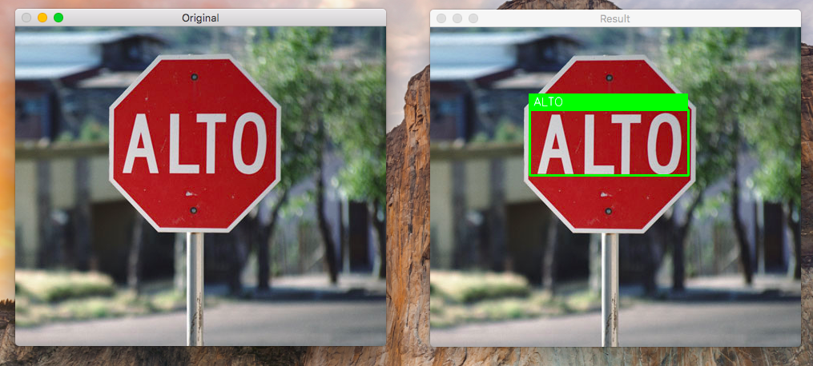
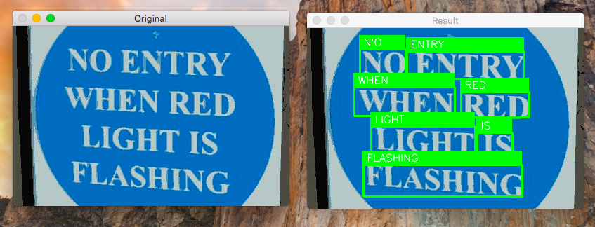

# Suri-Lens
This is a Text Detection and Recognition app with performance comparable to Google Lens's Text Selection feature.

## Reqiurements
- [OpenCV](https://docs.opencv.org/3.4.2/da/df6/tutorial_py_table_of_contents_setup.html) >= v3.4.2
- PyTesseract : `pip install pytesseract`
- imutils : `pip install --upgrade imutils`

## Usage
``` 
python main.py --image=[IMAGE_PATH]
```
Command Line arguments : 
- `--image` : The path to our input image.
- `--east` : The EAST scene text detector model file path.
- `--min-confidence` : Probability threshold to determine text. Optional with default=0.8 .
- `--width` : Resized image width — must be multiple of 32. Optional with default=320 .
- `--height` : Resized image height — must be multiple of 32. Optional with default=320 .

**Important**: The EAST text requires that your input image dimensions be multiples of 32, so if you choose to adjust your `--width`  and `--height`  values, make sure they are multiples of 32!

## Demo


